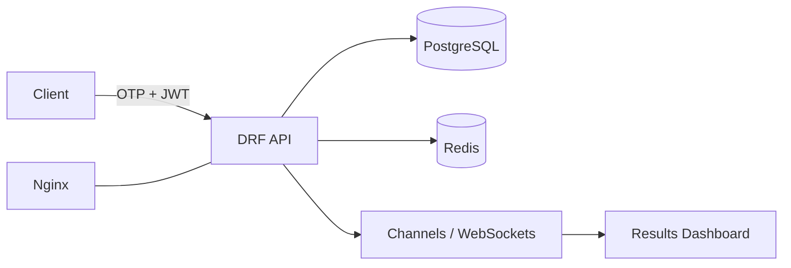

import Image from "next/image";

# ElectionHub – Secure Real‑Time Voting

Backend‑first voting system delivering instant tallies with strong authentication and auditability.

## Overview
ElectionHub is a production‑grade voting platform I architected and implemented at Bits and Bytes Consulting. It enables student electoral commissions to run multiple, concurrent elections with secure identity verification and real‑time dashboards.

**Impact:** handled **4,000+ votes** across three simultaneous elections with **zero downtime** and instant results.

## Role & Responsibilities
- Architected backend (Python, Django, DRF) and schema (PostgreSQL)
- Implemented OTP verification, device locking, JWT auth, and role‑based access control
- Built WebSocket channels for live tallies and event streams
- Wrote tamper‑evident audit logging and integrity checks
- Packaged deployments with Docker; served via Nginx + systemd on DigitalOcean

## Architecture
- **API:** Django REST Framework; auth via JWT (short‑lived access + refresh)
- **DB:** PostgreSQL with normalized ballots, candidates, contests; foreign‑key constraints + unique indexes
- **Realtime:** Django Channels/WebSockets broadcasting per‑contest tallies
- **Caching/Rate limiting:** Redis (OTP attempts, token blacklists)
- **Infra:** Dockerized app on DigitalOcean Droplet; Nginx reverse proxy; HTTPS via Let’s Encrypt

## Security & Integrity
- **OTP flows:** email/SMS OTP with expiry + sliding rate‑limits
- **Device binding:** fingerprint hash stored server‑side; suspicious changes trigger re‑verification
- **Audit logs:** append‑only event store (ballot cast, tally, admin action) with hash chaining for tamper evidence
- **RBAC:** commissioner, clerk, observer, voter roles; least‑privilege admin panels

## Key Features
- Parallel elections and contests
- Real‑time results + per‑contest streams
- Offline‑tolerant ballots with conflict resolution
- Exportable reports (CSV/PDF) and turnout analytics

## Outcomes
- Adopted by university student electoral bodies; smooth elections, instant tallies
- Operational runbooks enabled repeatable deploys and quick incident response

## Tech Stack
**Python, Django, DRF, PostgreSQL, Redis, Channels/WebSockets, Docker, Nginx, Let’s Encrypt, DigitalOcean**

---