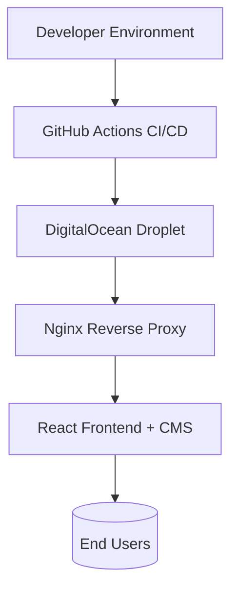

# ThinkStories – Communication & Knowledge Platform

> Development and deployment of the **ThinkStories** platform — a professional knowledge-sharing hub for African communicators.

## Overview
ThinkStories is a networking and storytelling platform designed for communication professionals across Africa. I led full-stack implementation and deployment under Bits and Bytes, following a 6-week project plan to deliver a responsive, content-driven site and integrated CMS.

**Client:** ThinkStories  
**Domain:** [thinkstoriesafrica.com](https://thinkstoriesafrica.com)  
**Duration:** June – July 2025  
**Hosting:** GoDaddy (with HTTPS, DNS, and mail routing)

## Project Scope
- **Website Development:** Static-style React frontend with dynamic CMS components.
- **Domain & SSL:** Registration, DNS configuration, HTTPS setup via Let’s Encrypt.
- **Core Pages:** Landing, About, Meet the Team, Case Studies (Google Drive integration), Testimonials (YouTube embeds), FAQs, and Contact.
- **Features:** Event registration, blog/resource CMS, webinar management, and event calendar.
- **Communication Setup:** Domain-based emails (info@thinkstoriesafrica.com) and integrated contact routing.

## Deliverables
| Deliverable | Description |
|--------------|-------------|
| Domain Setup | DNS, SSL, and routing for thinkstoriesafrica.com |
| Website Build | Fully responsive design with content modules |
| CMS Setup | Blog, team page, and events admin dashboard |
| Webinar System | Session management and scheduling interface |
| Email Setup | Domain-based email and message routing |
| SEO | Basic search optimization and social media integration |

## Technical Overview
- **Platform:** React frontend + lightweight CMS backend
- **Hosting:** DigitalOcean Droplet
- **SSL:** HTTPS with Let’s Encrypt
- **Deployment:** CI/CD pipeline with GitHub Actions → Docker build → Nginx reverse proxy
- **CMS:** Custom admin interface for content, blog posts, and event management

## Timeline
1. **Planning & Design:** June 1–7, 2025  
2. **Development & Integration:** June 8–24, 2025  
3. **Testing & Revisions:** June 25–July 5, 2025  
4. **Launch:** July 12, 2025

## Key Outcomes
- Fully deployed responsive website on DigitalOcean
- Integrated CMS with blog, webinars, and events
- Domain and SSL configuration for secure access
- Established email routing and analytics tracking

## Tech Stack
**React, Tailwind, Node.js (CMS backend), Nginx, Docker, DigitalOcean, Let’s Encrypt, GitHub Actions**